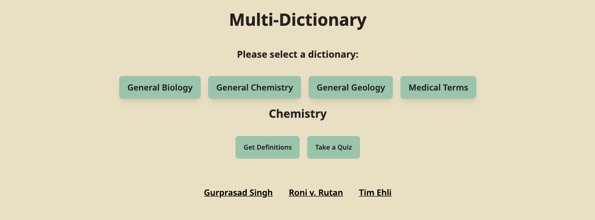
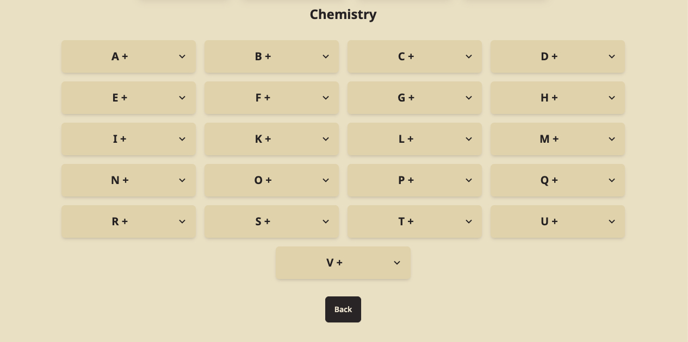
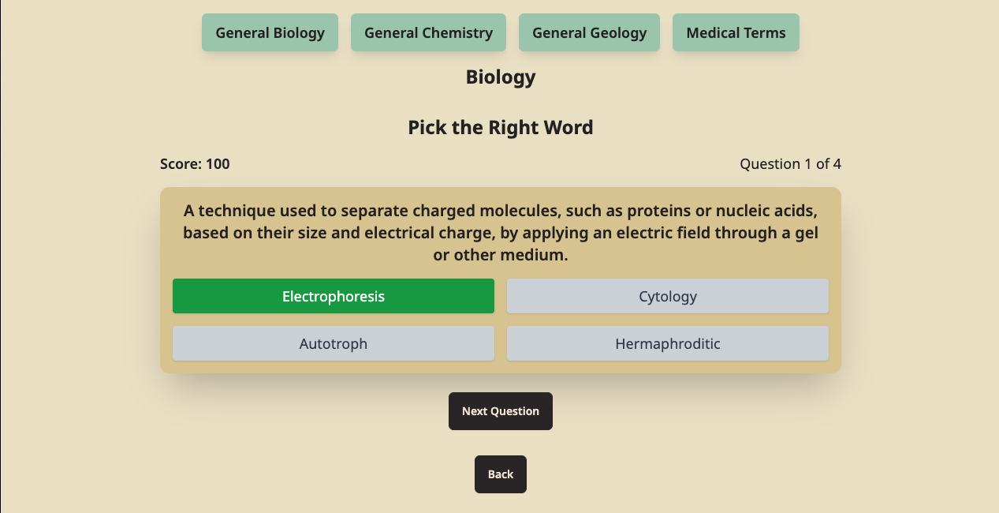

# Multi-Dictionary

A modern, user-friendly dictionary application that allows users to look up word definitions and test their knowledge through interactive quizzes.

## 🌟 Features

- 🔍 Word Definition Lookup
- 📚 Multiple Dictionary Sources
- 🎯 Interactive Quiz Mode
- 🎨 Modern and Responsive UI
- 🌙 Dark/Light Mode Support

## 🖼️ Screenshots

### Home Page


### Word Definitions


### Quiz Mode


## 🚀 Live Demo

Check out the live version of the application at: [https://multi-dictionary.ronirutan.com/](https://multi-dictionary.ronirutan.com/)

## 🛠️ Tech Stack

- React 18
- Vite
- React Router DOM
- Tailwind CSS
- DaisyUI
- ESLint

## 🚀 Getting Started

### Prerequisites

- Node.js (v16 or higher)
- npm or yarn

### Installation

1. Clone the repository:
```bash
git clone https://github.com/yourusername/multi-dictionary.git
cd multi-dictionary
```

2. Install dependencies:
```bash
npm install
# or
yarn install
```

3. Start the development server:
```bash
npm run dev
# or
yarn dev
```

4. Build for production:
```bash
npm run build
# or
yarn build
```

## 📝 License

This project is licensed under the MIT License - see the LICENSE file for details.

## 👥 Contributing

Contributions are welcome! Please feel free to submit a Pull Request.
